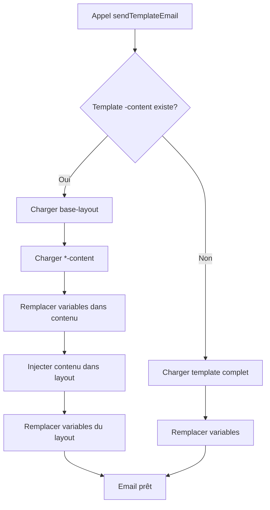

# 🏗️ Système de Layout pour les Emails

## Vue d'ensemble

Le système d'emails de My Center Academy utilise maintenant une **architecture modulaire en 2 couches** qui sépare le layout commun du contenu spécifique de chaque email. Cela permet une maintenance plus facile et une cohérence visuelle parfaite.

## Architecture

```
┌─────────────────────────────────────────┐
│     base-layout.template.html           │
│  ┌─────────────────────────────────┐   │
│  │         EN-TÊTE                  │   │
│  │  🎾 My Center Academy           │   │
│  │  Excellence en Tennis            │   │
│  └─────────────────────────────────┘   │
│                                          │
│  ┌─────────────────────────────────┐   │
│  │       {{content}}               │◄──┼─── Injection du contenu
│  │                                  │   │     depuis *-content.template.html
│  │   (Contenu dynamique injecté)   │   │
│  └─────────────────────────────────┘   │
│                                          │
│  ┌─────────────────────────────────┐   │
│  │      PIED DE PAGE                │   │
│  │  My Center Academy               │   │
│  │  © {{year}}                      │   │
│  └─────────────────────────────────┘   │
└─────────────────────────────────────────┘
```

## Composants

### 1. Layout de Base (`base-layout.template.html`)

**Rôle** : Structure commune à tous les emails

**Contenu** :
- En-tête avec branding My Center Academy
- Placeholder `{{content}}` pour le contenu dynamique
- Pied de page avec copyright et informations

**Variables** :
- `{{content}}` - Contenu injecté automatiquement
- `{{title}}` - Titre de la page HTML
- `{{preheader}}` - Texte de prévisualisation
- `{{year}}` - Année en cours

### 2. Templates de Contenu (`*-content.template.html`)

**Rôle** : Contenu spécifique de chaque type d'email

**Existants** :
- `welcome-email-content.template.html` - Email de bienvenue
- `reset-password-content.template.html` - Réinitialisation de mot de passe

**Structure type** :
```html
<!-- Icône -->
<table role="presentation">
  <tr>
    <td style="text-align: center; padding-bottom: 30px;">
      <div style="font-size: 60px;">👋</div>
    </td>
  </tr>
</table>

<!-- Titre -->
<h2>Bienvenue {{fullname}} !</h2>

<!-- Contenu -->
<p>{{message}}</p>

<!-- Bouton CTA -->
<table role="presentation">
  <tr>
    <td>
      <a href="{{url}}">Mon Action</a>
    </td>
  </tr>
</table>
```

### 3. Templates Complets (Compatibilité)

Pour la rétrocompatibilité, les templates complets (`*.template.html`) sont conservés. Si aucun template `-content` n'existe, le système utilise automatiquement le template complet.

## Flux de Construction



## Code - EmailService

```typescript
private async loadEmailTemplate(
  templatePath: string,
  replacements: Record<string, string>,
): Promise<string> {
  // 1. Charger le layout de base
  const layout = fs.readFileSync('base-layout.template.html', 'utf-8');
  
  // 2. Charger le contenu spécifique
  const contentPath = `${templateName}-content.template.html`;
  
  if (fs.existsSync(contentPath)) {
    // Mode layout + contenu
    let content = fs.readFileSync(contentPath, 'utf-8');
    
    // 3. Remplacer variables dans le contenu
    content = this.replaceVariables(content, replacements);
    
    // 4. Injecter le contenu dans le layout
    layout = layout.replace('{{content}}', content);
    
    // 5. Remplacer variables restantes (year, title, etc.)
    layout = this.replaceVariables(layout, replacements);
    
    return layout;
  } else {
    // Mode rétrocompatibilité - template complet
    return this.replaceVariables(fullTemplate, replacements);
  }
}
```

## Utilisation

### Envoyer un email avec le layout automatique

```typescript
await emailService.sendTemplateEmail(
  'user@example.com',
  '',
  'Bienvenue à My Center Academy',
  'welcome-email', // Utilisera welcome-email-content.template.html + layout
  {
    fullname: 'Jean Dupont',
    url: 'https://app.mycenteracademy.fr/set-password',
    year: '2025',
    title: 'Bienvenue', // Optionnel
    preheader: 'Configurez votre compte' // Optionnel
  }
);
```

## Avantages du Système

### 1. **Maintenance simplifiée**
- Modifier l'en-tête/pied de page : 1 seul fichier (`base-layout.template.html`)
- Ajouter un nouveau type d'email : créer uniquement le contenu

### 2. **Cohérence garantie**
- Tous les emails partagent le même en-tête, footer, styles
- Impossible d'avoir des emails avec des designs différents

### 3. **Développement accéléré**
- Nouveau template = ~50 lignes de contenu vs ~200 lignes complètes
- Focus sur le contenu, pas sur la structure

### 4. **Rétrocompatibilité**
- Les anciens templates complets continuent de fonctionner
- Migration progressive possible

### 5. **Testabilité**
- Layout et contenu peuvent être testés séparément
- Réutilisation facile pour tests unitaires

## Créer un Nouveau Template

### Étape 1 : Créer le contenu
```bash
# src/templates/confirmation-reservation-content.template.html
```

```html
<div style="text-align: center; font-size: 60px;">📅</div>

<h2>Réservation confirmée !</h2>

<p>Bonjour {{fullname}},</p>

<p>Votre réservation pour le {{date}} à {{heure}} est confirmée.</p>

<table role="presentation">
  <tr>
    <td style="text-align: center;">
      <a href="{{url}}" style="...">Voir ma réservation</a>
    </td>
  </tr>
</table>
```

### Étape 2 : Utiliser le nouveau template
```typescript
await emailService.sendTemplateEmail(
  user.email,
  '',
  'Confirmation de réservation',
  'confirmation-reservation', // Sans -content.template.html
  {
    fullname: user.fullname,
    date: '12 janvier 2025',
    heure: '14h00',
    url: 'https://app.mycenteracademy.fr/reservations/123',
    year: '2025'
  }
);
```

### Étape 3 : C'est tout ! ✅
Le système applique automatiquement le layout.

## Migration des Templates Existants

Les templates existants ont été migrés :

### Avant (templates complets)
- `welcome-email.template.html` - 195 lignes
- `reset-password.template.html` - 195 lignes
- **Total : 390 lignes** avec duplication

### Après (layout + contenu)
- `base-layout.template.html` - 150 lignes (réutilisable)
- `welcome-email-content.template.html` - 70 lignes
- `reset-password-content.template.html` - 75 lignes
- **Total : 295 lignes** sans duplication

**Économie : 95 lignes (24%)**

## Tests

Les emails générés avec le nouveau système sont **identiques visuellement** aux templates précédents :


## Troubleshooting

### Le contenu n'apparaît pas
- Vérifier que le fichier `*-content.template.html` existe
- Vérifier que le layout contient `{{content}}`

### Les variables ne sont pas remplacées
- Vérifier l'orthographe : `{{fullname}}` (sensible à la casse)
- Vérifier que la variable est passée dans `replacements`

### Layout personnalisé nécessaire
- Créer un template complet `*.template.html`
- Ne pas créer la version `-content`
- Le système utilisera automatiquement le template complet

---

**Date de création** : 2025-10-24  
**Version** : 1.0.0  
**Auteur** : GitHub Copilot pour My Center Academy
