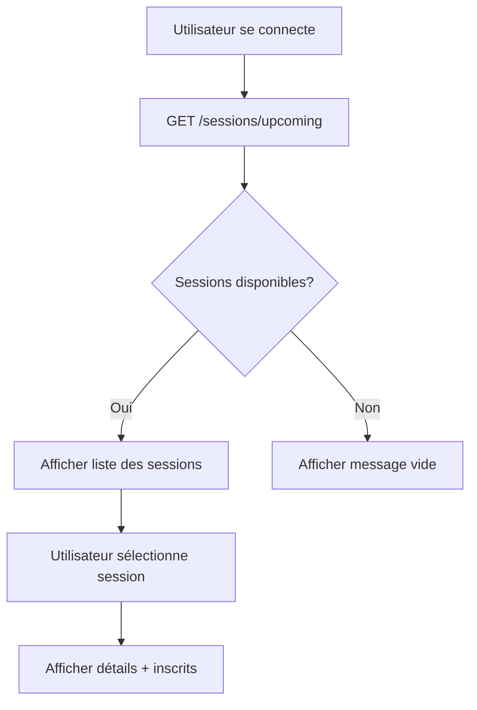
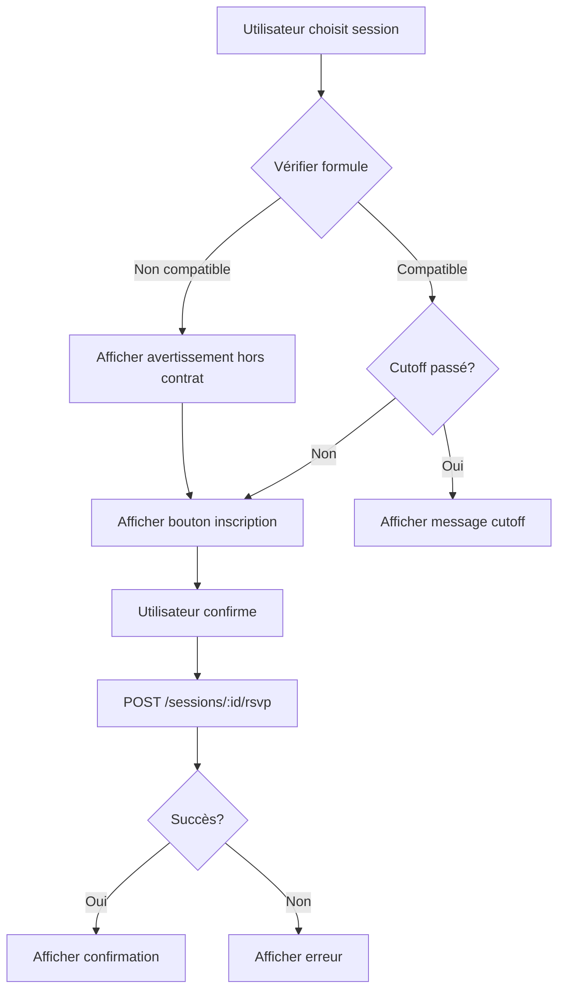
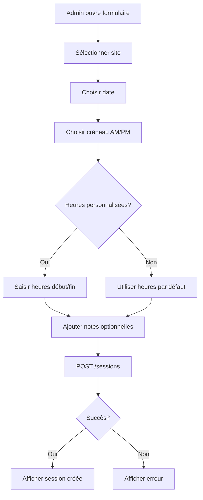
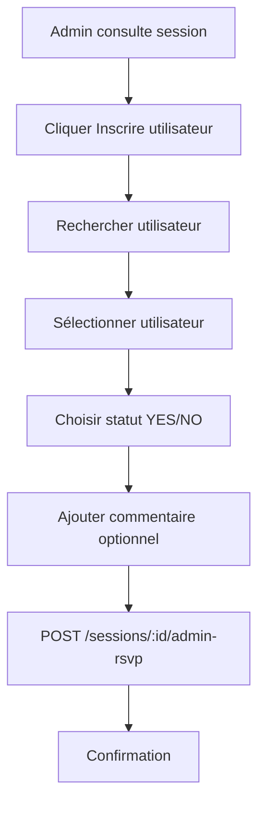

# Guide de Développement Frontend - MyCenter Academy

## Documentation Complète pour l'Interface de Gestion des Sessions d'Entraînement

---

## Table des Matières

1. [Vue d'ensemble](#vue-densemble)
2. [Modèles de Données](#modèles-de-données)
3. [Authentification et Rôles](#authentification-et-rôles)
4. [API Endpoints](#api-endpoints)
5. [Cas d'Usage et Flux](#cas-dusage-et-flux)
6. [Exemples de Code](#exemples-de-code)
7. [Gestion des Erreurs](#gestion-des-erreurs)
8. [Règles Métier](#règles-métier)

---

## Vue d'ensemble

L'API MyCenter Academy permet de gérer complètement les sessions d'entraînement avec les fonctionnalités suivantes :

- **Gestion des sessions** : Création, modification, suppression par les administrateurs
- **Inscription des utilisateurs** : Inscription automatique avec validation de formule
- **Inscription administrative** : Override complet pour les administrateurs
- **Filtrage avancé** : Recherche par site, date, créneau, statut
- **Heures personnalisables** : Chaque session peut avoir des heures de début/fin spécifiques

---

## Modèles de Données

### Session

```typescript
interface Session {
  id: string; // UUID de la session
  siteId: string; // UUID du site
  date: string; // Date de la session (ISO 8601)
  slot: 'AM' | 'PM'; // Créneau matin ou après-midi
  startTime: string | null; // Heure de début (ISO 8601) - optionnel
  endTime: string | null; // Heure de fin (ISO 8601) - optionnel
  isPublished: boolean; // Session publiée ?
  publishedAt: string | null; // Date de publication
  isCanceled: boolean; // Session annulée ?
  notes: string | null; // Notes administratives
  createdAt: string; // Date de création
  updatedAt: string | null; // Date de dernière modification

  // Relations
  site: Site; // Informations du site
  attendances: Attendance[]; // Liste des inscriptions
}
```

### Site

```typescript
interface Site {
  id: string; // UUID du site
  name: string; // Nom du site
  isActive: boolean; // Site actif ?
  createdAt: string;
  updatedAt: string | null;
}
```

### User

```typescript
interface User {
  id: string; // UUID de l'utilisateur
  role: 'user' | 'admin'; // Rôle de l'utilisateur
  firstname: string; // Prénom
  lastname: string; // Nom
  email: string; // Email unique
  phone: string | null; // Téléphone
  birthDate: string | null; // Date de naissance
  fftLicenseNumber: string | null; // Numéro de licence FFT
  formula: 'MORNING' | 'AFTERNOON' | 'FULL' | null; // Formule d'abonnement

  // Préférences de notification
  notifyEmail: boolean;
  notifySMS: boolean;
  notifyWhatsApp: boolean;

  createdAt: string;
  updatedAt: string | null;
}
```

### Attendance (Inscription)

```typescript
interface Attendance {
  id: string; // UUID de l'inscription
  sessionId: string; // UUID de la session
  userId: string; // UUID de l'utilisateur
  status: 'YES' | 'NO'; // Présence confirmée ou non
  comment: string | null; // Commentaire de l'utilisateur
  respondedAt: string; // Date de réponse
  outOfContract: boolean; // Hors formule (facturation extra)
  createdByAdmin: boolean; // Inscription faite par admin ?
  createdAt: string;
  updatedAt: string | null;

  // Relations
  user: User; // Informations de l'utilisateur
  session: Session; // Informations de la session
}
```

### Enums

```typescript
// Créneaux de session
enum SessionSlot {
  AM = 'AM', // Matin (9h00-12h00 par défaut)
  PM = 'PM', // Après-midi (14h00-17h00 par défaut)
}

// Statut de présence
enum AttendanceStatus {
  YES = 'YES', // Présent
  NO = 'NO', // Absent
}

// Type de formule
enum FormulaType {
  MORNING = 'MORNING', // Accès AM uniquement
  AFTERNOON = 'AFTERNOON', // Accès PM uniquement
  FULL = 'FULL', // Accès AM + PM
}

// Rôles utilisateur
enum Role {
  user = 'user',
  admin = 'admin',
}
```

---

## Authentification et Rôles

### Header d'authentification

Tous les appels API nécessitent un token JWT dans le header :

```http
Authorization: Bearer <jwt_token>
```

### Permissions par rôle

#### Utilisateur Standard (`user`)

- ✅ Consulter les sessions publiées
- ✅ S'inscrire aux sessions correspondant à sa formule
- ✅ Voir ses propres inscriptions
- ❌ Créer/modifier/supprimer des sessions
- ❌ Inscrire d'autres utilisateurs

#### Administrateur (`admin`)

- ✅ Toutes les permissions utilisateur
- ✅ Créer, modifier, supprimer des sessions
- ✅ Inscrire n'importe quel utilisateur sans restriction
- ✅ Voir toutes les inscriptions
- ✅ Bypasser les délais de coupure (cutoff)

---

## API Endpoints

### Base URL

```
https://api.mc-academy.com
```

### 1. Récupérer les sessions à venir

```http
GET /sessions/upcoming
```

**Description** : Récupère toutes les sessions futures (date >= aujourd'hui)

**Authentification** : Requise

**Réponse** :

```json
[
  {
    "id": "uuid",
    "siteId": "uuid",
    "date": "2024-03-20T00:00:00.000Z",
    "slot": "AM",
    "startTime": "2024-03-20T09:00:00.000Z",
    "endTime": "2024-03-20T12:00:00.000Z",
    "isPublished": true,
    "publishedAt": "2024-03-13T20:00:00.000Z",
    "isCanceled": false,
    "notes": null,
    "site": {
      "id": "uuid",
      "name": "Centre Paris 15",
      "isActive": true
    },
    "attendances": [
      {
        "id": "uuid",
        "userId": "uuid",
        "status": "YES",
        "comment": "Je serai là !",
        "outOfContract": false,
        "createdByAdmin": false,
        "user": {
          "id": "uuid",
          "firstname": "Jean",
          "lastname": "Dupont",
          "email": "jean.dupont@example.com"
        }
      }
    ]
  }
]
```

---

### 2. Récupérer les sessions avec filtres

```http
GET /sessions?siteId={siteId}&startDate={startDate}&endDate={endDate}&slot={slot}&isPublished={boolean}&isCanceled={boolean}
```

**Description** : Récupère les sessions avec filtres optionnels

**Authentification** : Requise

**Paramètres de requête** :
| Paramètre | Type | Obligatoire | Description | Exemple |
|-----------|------|-------------|-------------|---------|
| `siteId` | string | Non | Filtrer par site | `?siteId=uuid` |
| `startDate` | string (ISO) | Non | Date de début | `?startDate=2024-03-01T00:00:00.000Z` |
| `endDate` | string (ISO) | Non | Date de fin | `?endDate=2024-03-31T23:59:59.999Z` |
| `slot` | string | Non | Filtrer par créneau | `?slot=AM` ou `?slot=PM` |
| `isPublished` | boolean | Non | Sessions publiées | `?isPublished=true` |
| `isCanceled` | boolean | Non | Sessions annulées | `?isCanceled=false` |

**Exemples** :

```http
# Sessions du matin en mars 2024
GET /sessions?slot=AM&startDate=2024-03-01&endDate=2024-03-31

# Sessions publiées non annulées pour un site
GET /sessions?siteId=uuid&isPublished=true&isCanceled=false

# Toutes les sessions d'une semaine
GET /sessions?startDate=2024-03-18&endDate=2024-03-24
```

**Réponse** : Même format que `/sessions/upcoming`

---

### 3. Récupérer une session spécifique

```http
GET /sessions/:id
```

**Description** : Récupère les détails d'une session

**Authentification** : Requise

**Paramètres** :

- `id` (path) : UUID de la session

**Réponse** : Objet session complet (voir format ci-dessus)

**Codes d'erreur** :

- `404` : Session non trouvée

---

### 4. Créer une session (Admin uniquement)

```http
POST /sessions
```

**Description** : Crée une nouvelle session d'entraînement

**Authentification** : Requise (Admin)

**Body** :

```json
{
  "siteId": "uuid", // Obligatoire
  "date": "2024-03-20T00:00:00.000Z", // Obligatoire (ISO 8601)
  "slot": "AM", // Obligatoire ("AM" ou "PM")
  "startTime": "2024-03-20T09:30:00.000Z", // Optionnel (ISO 8601)
  "endTime": "2024-03-20T11:30:00.000Z", // Optionnel (ISO 8601)
  "notes": "Session spéciale débutants", // Optionnel
  "isPublished": true // Optionnel (default: false)
}
```

**Validation** :

- `siteId` doit exister
- `date` doit être au format ISO 8601
- `slot` doit être "AM" ou "PM"
- Si `startTime` et `endTime` fournis, `startTime` < `endTime`
- Pas de doublon : une seule session par site/date/slot

**Réponse** : Objet session créé

**Codes d'erreur** :

- `400` : Données invalides ou session déjà existante
- `401` : Non authentifié
- `403` : Pas les droits admin
- `404` : Site non trouvé

---

### 5. Modifier une session (Admin uniquement)

```http
PUT /sessions/:id
```

**Description** : Modifie une session existante

**Authentification** : Requise (Admin)

**Paramètres** :

- `id` (path) : UUID de la session

**Body** : Tous les champs sont optionnels

```json
{
  "siteId": "uuid", // Optionnel
  "date": "2024-03-21T00:00:00.000Z", // Optionnel
  "slot": "PM", // Optionnel
  "startTime": "2024-03-21T14:00:00.000Z", // Optionnel
  "endTime": "2024-03-21T16:00:00.000Z", // Optionnel
  "notes": "Session modifiée", // Optionnel
  "isPublished": true, // Optionnel
  "isCanceled": false // Optionnel
}
```

**Réponse** : Objet session mis à jour

**Codes d'erreur** :

- `400` : Données invalides
- `401` : Non authentifié
- `403` : Pas les droits admin
- `404` : Session non trouvée

---

### 6. Supprimer une session (Admin uniquement)

```http
DELETE /sessions/:id
```

**Description** : Supprime définitivement une session et toutes ses inscriptions

**Authentification** : Requise (Admin)

**Paramètres** :

- `id` (path) : UUID de la session

**Réponse** :

```json
{
  "message": "Session deleted successfully"
}
```

**Codes d'erreur** :

- `401` : Non authentifié
- `403` : Pas les droits admin
- `404` : Session non trouvée

---

### 7. S'inscrire à une session (Utilisateur)

```http
POST /sessions/:id/rsvp
```

**Description** : Inscription d'un utilisateur à une session

**Authentification** : Requise

**Paramètres** :

- `id` (path) : UUID de la session

**Body** :

```json
{
  "status": "YES", // Obligatoire ("YES" ou "NO")
  "comment": "Je serai présent !" // Optionnel
}
```

**Règles de validation** :

1. ✅ La session doit exister
2. ✅ Le cutoff (vendredi 18h00) ne doit pas être passé
3. ✅ L'utilisateur doit avoir une formule correspondante :
   - Formule `MORNING` → peut s'inscrire aux sessions `AM`
   - Formule `AFTERNOON` → peut s'inscrire aux sessions `PM`
   - Formule `FULL` → peut s'inscrire aux sessions `AM` et `PM`
4. ⚠️ Si l'utilisateur s'inscrit hors formule, `outOfContract` sera `true`

**Réponse** :

```json
{
  "id": "uuid",
  "sessionId": "uuid",
  "userId": "uuid",
  "status": "YES",
  "comment": "Je serai présent !",
  "respondedAt": "2024-03-10T15:30:00.000Z",
  "outOfContract": false,
  "createdByAdmin": false
}
```

**Codes d'erreur** :

- `401` : Non authentifié
- `403` : Cutoff passé ou formule non compatible
- `404` : Session ou utilisateur non trouvé

---

### 8. Inscription administrative (Admin uniquement)

```http
POST /sessions/:id/admin-rsvp
```

**Description** : Inscription forcée par un administrateur (bypass toutes les restrictions)

**Authentification** : Requise (Admin)

**Paramètres** :

- `id` (path) : UUID de la session

**Body** :

```json
{
  "userId": "uuid", // Obligatoire
  "status": "YES", // Obligatoire ("YES" ou "NO")
  "comment": "Inscription manuelle" // Optionnel
}
```

**Différences avec l'inscription normale** :

- ✅ Bypass du cutoff (vendredi 18h00)
- ✅ Bypass de la validation de formule
- ✅ Peut inscrire n'importe quel utilisateur
- ✅ `createdByAdmin` sera `true`

**Réponse** :

```json
{
  "id": "uuid",
  "sessionId": "uuid",
  "userId": "uuid",
  "status": "YES",
  "comment": "Inscription manuelle",
  "respondedAt": "2024-03-10T15:30:00.000Z",
  "outOfContract": true,
  "createdByAdmin": true
}
```

**Codes d'erreur** :

- `401` : Non authentifié
- `403` : Pas les droits admin
- `404` : Session ou utilisateur non trouvé

---

## Cas d'Usage et Flux

### Flux 1 : Consultation des sessions (Utilisateur)



**Implémentation recommandée** :

```typescript
async function fetchUpcomingSessions() {
  const response = await fetch('/sessions/upcoming', {
    headers: {
      Authorization: `Bearer ${token}`,
    },
  });

  const sessions = await response.json();
  return sessions;
}
```

---

### Flux 2 : Inscription à une session (Utilisateur)



**Implémentation recommandée** :

```typescript
async function registerToSession(
  sessionId: string,
  status: 'YES' | 'NO',
  comment?: string,
) {
  try {
    const response = await fetch(`/sessions/${sessionId}/rsvp`, {
      method: 'POST',
      headers: {
        Authorization: `Bearer ${token}`,
        'Content-Type': 'application/json',
      },
      body: JSON.stringify({ status, comment }),
    });

    if (!response.ok) {
      const error = await response.json();
      throw new Error(error.message);
    }

    return await response.json();
  } catch (error) {
    // Gérer les erreurs (cutoff, formule, etc.)
    handleRegistrationError(error);
  }
}
```

---

### Flux 3 : Création de session (Admin)



**Implémentation recommandée** :

```typescript
async function createSession(data: CreateSessionDto) {
  const response = await fetch('/sessions', {
    method: 'POST',
    headers: {
      Authorization: `Bearer ${token}`,
      'Content-Type': 'application/json',
    },
    body: JSON.stringify(data),
  });

  if (!response.ok) {
    const error = await response.json();
    throw new Error(error.message);
  }

  return await response.json();
}
```

---

### Flux 4 : Inscription administrative (Admin)



---

## Exemples de Code

### Exemple complet : Composant React de liste de sessions

```tsx
import React, { useState, useEffect } from 'react';

interface Session {
  id: string;
  date: string;
  slot: 'AM' | 'PM';
  startTime: string | null;
  endTime: string | null;
  site: {
    name: string;
  };
  attendances: Array<{
    user: { firstname: string; lastname: string };
  }>;
}

const SessionsList: React.FC = () => {
  const [sessions, setSessions] = useState<Session[]>([]);
  const [loading, setLoading] = useState(true);
  const [filter, setFilter] = useState({
    slot: '',
    siteId: '',
  });

  useEffect(() => {
    fetchSessions();
  }, [filter]);

  const fetchSessions = async () => {
    setLoading(true);
    try {
      const params = new URLSearchParams();
      if (filter.slot) params.append('slot', filter.slot);
      if (filter.siteId) params.append('siteId', filter.siteId);

      const response = await fetch(`/sessions/upcoming?${params}`, {
        headers: {
          Authorization: `Bearer ${localStorage.getItem('token')}`,
        },
      });

      const data = await response.json();
      setSessions(data);
    } catch (error) {
      console.error('Erreur:', error);
    } finally {
      setLoading(false);
    }
  };

  const formatTime = (dateString: string | null) => {
    if (!dateString) return null;
    return new Date(dateString).toLocaleTimeString('fr-FR', {
      hour: '2-digit',
      minute: '2-digit',
    });
  };

  const formatDate = (dateString: string) => {
    return new Date(dateString).toLocaleDateString('fr-FR', {
      weekday: 'long',
      day: 'numeric',
      month: 'long',
    });
  };

  return (
    <div className="sessions-list">
      <h1>Sessions d'Entraînement</h1>

      {/* Filtres */}
      <div className="filters">
        <select
          value={filter.slot}
          onChange={e => setFilter({ ...filter, slot: e.target.value })}
        >
          <option value="">Tous les créneaux</option>
          <option value="AM">Matin</option>
          <option value="PM">Après-midi</option>
        </select>
      </div>

      {/* Liste des sessions */}
      {loading ? (
        <p>Chargement...</p>
      ) : (
        <div className="sessions-grid">
          {sessions.map(session => (
            <div key={session.id} className="session-card">
              <h3>{session.site.name}</h3>
              <p className="date">{formatDate(session.date)}</p>
              <p className="time">
                {session.slot === 'AM' ? '🌅 Matin' : '☀️ Après-midi'}
                {session.startTime &&
                  ` (${formatTime(session.startTime)} - ${formatTime(session.endTime)})`}
              </p>
              <p className="attendees">
                👥 {session.attendances.length} inscrit(s)
              </p>
              <button onClick={() => handleRegister(session.id)}>
                S'inscrire
              </button>
            </div>
          ))}
        </div>
      )}
    </div>
  );
};

export default SessionsList;
```

---

### Exemple : Formulaire de création de session (Admin)

```tsx
import React, { useState } from 'react';

const CreateSessionForm: React.FC = () => {
  const [formData, setFormData] = useState({
    siteId: '',
    date: '',
    slot: 'AM' as 'AM' | 'PM',
    startTime: '',
    endTime: '',
    notes: '',
    isPublished: false,
  });

  const handleSubmit = async (e: React.FormEvent) => {
    e.preventDefault();

    try {
      // Construire le payload
      const payload: any = {
        siteId: formData.siteId,
        date: new Date(formData.date).toISOString(),
        slot: formData.slot,
        isPublished: formData.isPublished,
      };

      // Ajouter les heures si personnalisées
      if (formData.startTime) {
        const [hours, minutes] = formData.startTime.split(':');
        const startDate = new Date(formData.date);
        startDate.setHours(parseInt(hours), parseInt(minutes));
        payload.startTime = startDate.toISOString();
      }

      if (formData.endTime) {
        const [hours, minutes] = formData.endTime.split(':');
        const endDate = new Date(formData.date);
        endDate.setHours(parseInt(hours), parseInt(minutes));
        payload.endTime = endDate.toISOString();
      }

      if (formData.notes) {
        payload.notes = formData.notes;
      }

      // Envoyer la requête
      const response = await fetch('/sessions', {
        method: 'POST',
        headers: {
          Authorization: `Bearer ${localStorage.getItem('token')}`,
          'Content-Type': 'application/json',
        },
        body: JSON.stringify(payload),
      });

      if (!response.ok) {
        const error = await response.json();
        throw new Error(error.message);
      }

      const session = await response.json();
      alert('Session créée avec succès !');

      // Réinitialiser le formulaire
      setFormData({
        siteId: '',
        date: '',
        slot: 'AM',
        startTime: '',
        endTime: '',
        notes: '',
        isPublished: false,
      });
    } catch (error) {
      alert(`Erreur: ${error.message}`);
    }
  };

  return (
    <form onSubmit={handleSubmit} className="create-session-form">
      <h2>Créer une Session</h2>

      <div className="form-group">
        <label>Site *</label>
        <select
          value={formData.siteId}
          onChange={e => setFormData({ ...formData, siteId: e.target.value })}
          required
        >
          <option value="">Sélectionner un site</option>
          {/* Charger la liste des sites depuis l'API */}
        </select>
      </div>

      <div className="form-group">
        <label>Date *</label>
        <input
          type="date"
          value={formData.date}
          onChange={e => setFormData({ ...formData, date: e.target.value })}
          required
        />
      </div>

      <div className="form-group">
        <label>Créneau *</label>
        <select
          value={formData.slot}
          onChange={e =>
            setFormData({ ...formData, slot: e.target.value as 'AM' | 'PM' })
          }
        >
          <option value="AM">Matin (9h-12h par défaut)</option>
          <option value="PM">Après-midi (14h-17h par défaut)</option>
        </select>
      </div>

      <div className="form-row">
        <div className="form-group">
          <label>Heure de début (personnalisée)</label>
          <input
            type="time"
            value={formData.startTime}
            onChange={e =>
              setFormData({ ...formData, startTime: e.target.value })
            }
          />
        </div>

        <div className="form-group">
          <label>Heure de fin (personnalisée)</label>
          <input
            type="time"
            value={formData.endTime}
            onChange={e =>
              setFormData({ ...formData, endTime: e.target.value })
            }
          />
        </div>
      </div>

      <div className="form-group">
        <label>Notes</label>
        <textarea
          value={formData.notes}
          onChange={e => setFormData({ ...formData, notes: e.target.value })}
          placeholder="Informations supplémentaires..."
        />
      </div>

      <div className="form-group checkbox">
        <label>
          <input
            type="checkbox"
            checked={formData.isPublished}
            onChange={e =>
              setFormData({ ...formData, isPublished: e.target.checked })
            }
          />
          Publier immédiatement
        </label>
      </div>

      <button type="submit">Créer la session</button>
    </form>
  );
};

export default CreateSessionForm;
```

---

## Gestion des Erreurs

### Codes HTTP et Messages

| Code  | Type         | Description           | Action recommandée                      |
| ----- | ------------ | --------------------- | --------------------------------------- |
| `400` | Bad Request  | Données invalides     | Vérifier le format des données envoyées |
| `401` | Unauthorized | Non authentifié       | Rediriger vers la page de connexion     |
| `403` | Forbidden    | Pas les permissions   | Afficher message "Accès refusé"         |
| `404` | Not Found    | Ressource non trouvée | Afficher message "Non trouvé"           |
| `500` | Server Error | Erreur serveur        | Afficher message d'erreur générique     |

### Exemples de messages d'erreur

```json
// 400 - Données invalides
{
  "statusCode": 400,
  "message": "Start time must be before end time",
  "error": "Bad Request"
}

// 403 - Cutoff passé
{
  "statusCode": 403,
  "message": "Cutoff passed",
  "error": "Forbidden"
}

// 404 - Session non trouvée
{
  "statusCode": 404,
  "message": "Session not found",
  "error": "Not Found"
}
```

### Fonction utilitaire de gestion d'erreurs

```typescript
function handleApiError(error: any) {
  if (error.statusCode === 401) {
    // Rediriger vers login
    window.location.href = '/login';
    return;
  }

  const messages: Record<string, string> = {
    'Cutoff passed':
      "La date limite d'inscription est dépassée (vendredi 18h00)",
    'Session not found': "Cette session n'existe plus",
    'Site not found': "Le site sélectionné n'existe pas",
    'User not found': 'Utilisateur non trouvé',
    'Start time must be before end time':
      "L'heure de début doit être avant l'heure de fin",
    'A session already exists for this site, date, and slot':
      'Une session existe déjà pour ce créneau',
  };

  const userMessage =
    messages[error.message] || error.message || 'Une erreur est survenue';

  // Afficher un toast ou une alerte
  showNotification(userMessage, 'error');
}
```

---

## Règles Métier

### 1. Heures par défaut

Si `startTime` et `endTime` ne sont pas spécifiés lors de la création :

- **Matin (AM)** : 9h00 - 12h00
- **Après-midi (PM)** : 14h00 - 17h00

### 2. Cutoff (Date limite)

**Règle** : Les inscriptions utilisateur sont fermées le **vendredi 18h00** de la semaine de la session.

**Implémentation recommandée** :

```typescript
function isCutoffPassed(sessionDate: Date): boolean {
  const now = new Date();

  // Trouver le vendredi de la semaine de la session
  const sessionDay = new Date(sessionDate);
  const dayOfWeek = sessionDay.getDay(); // 0 = dimanche, 5 = vendredi
  const daysUntilFriday = dayOfWeek >= 5 ? dayOfWeek - 5 : 7 + dayOfWeek - 5;

  const fridayCutoff = new Date(sessionDay);
  fridayCutoff.setDate(sessionDay.getDate() - daysUntilFriday);
  fridayCutoff.setHours(18, 0, 0, 0);

  return now > fridayCutoff;
}
```

**Affichage UI** :

```tsx
{
  isCutoffPassed(session.date) ? (
    <p className="warning">⚠️ Inscriptions fermées (cutoff dépassé)</p>
  ) : (
    <button onClick={handleRegister}>S'inscrire</button>
  );
}
```

### 3. Validation de formule

**Règle** : Un utilisateur peut s'inscrire seulement si :

- Formule `MORNING` → Sessions `AM` uniquement
- Formule `AFTERNOON` → Sessions `PM` uniquement
- Formule `FULL` → Toutes les sessions
- Formule `null` → Aucune inscription possible

**Implémentation recommandée** :

```typescript
function canUserRegister(
  userFormula: string | null,
  sessionSlot: string,
): {
  allowed: boolean;
  outOfContract: boolean;
  message?: string;
} {
  if (!userFormula) {
    return {
      allowed: false,
      outOfContract: false,
      message: "Vous devez avoir une formule d'abonnement pour vous inscrire",
    };
  }

  if (userFormula === 'FULL') {
    return { allowed: true, outOfContract: false };
  }

  if (userFormula === 'MORNING' && sessionSlot === 'AM') {
    return { allowed: true, outOfContract: false };
  }

  if (userFormula === 'AFTERNOON' && sessionSlot === 'PM') {
    return { allowed: true, outOfContract: false };
  }

  // Hors contrat mais inscription possible
  return {
    allowed: true,
    outOfContract: true,
    message:
      'Cette session est hors de votre formule et sera facturée en supplément',
  };
}
```

**Affichage UI** :

```tsx
const registrationInfo = canUserRegister(user.formula, session.slot);

{
  registrationInfo.allowed ? (
    <>
      {registrationInfo.outOfContract && (
        <p className="warning">⚠️ {registrationInfo.message}</p>
      )}
      <button onClick={handleRegister}>S'inscrire</button>
    </>
  ) : (
    <p className="error">{registrationInfo.message}</p>
  );
}
```

### 4. Sessions publiées

**Règle** : Les utilisateurs ne voient que les sessions où `isPublished = true`

Les administrateurs peuvent voir toutes les sessions.

**Implémentation recommandée** :

```typescript
// Pour les utilisateurs
const publishedSessions = sessions.filter(s => s.isPublished);

// Pour les admins
const allSessions = sessions;
```

### 5. Sessions annulées

**Règle** : Les sessions avec `isCanceled = true` doivent être clairement marquées.

**Affichage UI** :

```tsx
{
  session.isCanceled && (
    <div className="canceled-badge">❌ Session annulée</div>
  );
}
```

---

## Bonnes Pratiques

### 1. Gestion du cache

```typescript
// Utiliser React Query ou SWR pour le cache automatique
import { useQuery } from 'react-query';

function useSessions(filters: any) {
  return useQuery(['sessions', filters], () => fetchSessions(filters), {
    staleTime: 5 * 60 * 1000, // 5 minutes
    cacheTime: 10 * 60 * 1000, // 10 minutes
  });
}
```

### 2. Optimistic Updates

```typescript
async function registerToSession(sessionId: string, status: string) {
  // Mise à jour optimiste de l'UI
  updateUIOptimistically(sessionId, status);

  try {
    await fetch(`/sessions/${sessionId}/rsvp`, {
      method: 'POST',
      body: JSON.stringify({ status }),
    });
  } catch (error) {
    // Annuler la mise à jour optimiste
    revertUIUpdate(sessionId);
    throw error;
  }
}
```

### 3. Formatage des dates

```typescript
// Utiliser une bibliothèque comme date-fns
import { format, parseISO } from 'date-fns';
import { fr } from 'date-fns/locale';

function formatSessionDate(dateString: string): string {
  const date = parseISO(dateString);
  return format(date, 'EEEE d MMMM yyyy', { locale: fr });
  // Ex: "mercredi 20 mars 2024"
}

function formatTime(dateString: string): string {
  const date = parseISO(dateString);
  return format(date, 'HH:mm');
  // Ex: "09:30"
}
```

### 4. Validation côté client

```typescript
import * as yup from 'yup';

const createSessionSchema = yup.object({
  siteId: yup.string().required('Le site est obligatoire'),
  date: yup
    .date()
    .required('La date est obligatoire')
    .min(new Date(), 'La date doit être dans le futur'),
  slot: yup.string().oneOf(['AM', 'PM']).required(),
  startTime: yup.date().when('endTime', {
    is: (val: any) => !!val,
    then: schema =>
      schema
        .required("L'heure de début est requise")
        .test(
          'before-end',
          "L'heure de début doit être avant l'heure de fin",
          function (value) {
            return !this.parent.endTime || value < this.parent.endTime;
          },
        ),
  }),
});
```

---

## Checklist de Développement

### Interface Utilisateur

- [ ] Page de liste des sessions avec filtres
- [ ] Page de détails d'une session
- [ ] Formulaire d'inscription avec confirmation
- [ ] Affichage des inscriptions de l'utilisateur
- [ ] Gestion des sessions hors formule avec avertissement
- [ ] Affichage du cutoff et désactivation après date limite
- [ ] Indication visuelle des sessions complètes/annulées

### Interface Administrateur

- [ ] Tableau de bord des sessions
- [ ] Formulaire de création de session
- [ ] Formulaire de modification de session
- [ ] Confirmation de suppression de session
- [ ] Liste des inscrits par session
- [ ] Formulaire d'inscription manuelle d'utilisateurs
- [ ] Filtres avancés (date, site, statut, etc.)
- [ ] Export des données (CSV, Excel)

### Fonctionnalités Transverses

- [ ] Authentification et gestion du token JWT
- [ ] Gestion des rôles (user/admin)
- [ ] Notifications (toasts) pour les succès/erreurs
- [ ] Loading states pendant les requêtes
- [ ] Gestion des erreurs avec messages explicites
- [ ] Mode responsive (mobile, tablette, desktop)
- [ ] Internationalisation (si nécessaire)

---

## Support et Contact

Pour toute question sur l'API ou cette documentation :

- **Email** : hubert.cole@devolut.fr
- **Repository** : [AGS-hcole/mc-academy-api](https://github.com/AGS-hcole/mc-academy-api)

---

## Changelog

- **v1.0.0** (2024-03-28) : Documentation initiale complète
  - Tous les endpoints documentés
  - Exemples de code React/TypeScript
  - Règles métier détaillées
  - Cas d'usage et flux utilisateur
