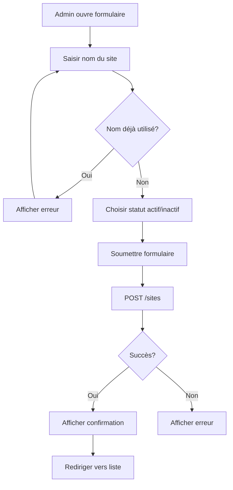
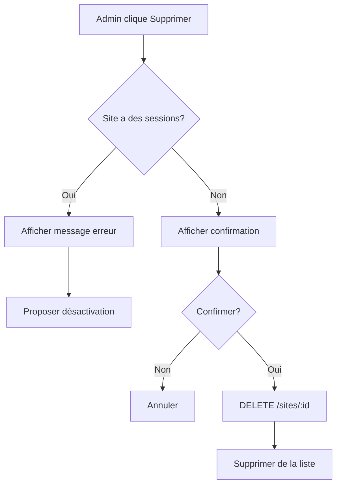

# Guide de Gestion des Sites - MyCenter Academy
## Documentation pour le Développement Frontend

---

## Table des Matières

1. [Vue d'ensemble](#vue-densemble)
2. [Modèle de Données](#modèle-de-données)
3. [API Endpoints](#api-endpoints)
4. [Exemples de Code](#exemples-de-code)
5. [Gestion des Erreurs](#gestion-des-erreurs)
6. [Règles Métier](#règles-métier)

---

## Vue d'ensemble

Le module de gestion des sites permet aux administrateurs de créer, modifier et supprimer les sites d'entraînement. Les sites sont utilisés pour organiser les sessions d'entraînement.

**Fonctionnalités principales** :
- ✅ Liste de tous les sites
- ✅ Filtrage des sites actifs
- ✅ Détails d'un site avec statistiques de sessions
- ✅ Création de nouveaux sites (admin uniquement)
- ✅ Modification de sites existants (admin uniquement)
- ✅ Suppression de sites (admin uniquement, avec protection)

---

## Modèle de Données

### Site

```typescript
interface Site {
  id: string;                    // UUID du site
  name: string;                  // Nom du site (unique)
  isActive: boolean;             // Site actif ?
  createdAt: string;             // Date de création (ISO 8601)
  updatedAt: string | null;      // Date de dernière modification
  
  // Relations (incluses selon l'endpoint)
  sessions?: Session[];          // Sessions associées
  _count?: {
    sessions: number;            // Nombre de sessions
  };
}
```

### Validation

- **name** : Chaîne de caractères non vide, unique
- **isActive** : Booléen (par défaut : `true`)

---

## API Endpoints

### Base URL
```
https://api.mc-academy.com
```

---

### 1. Récupérer tous les sites

```http
GET /sites
```

**Description** : Récupère la liste de tous les sites (actifs et inactifs)

**Authentification** : Requise

**Réponse** :
```json
[
  {
    "id": "uuid",
    "name": "Centre Paris 15",
    "isActive": true,
    "createdAt": "2024-01-15T10:00:00.000Z",
    "updatedAt": "2024-02-20T14:30:00.000Z",
    "_count": {
      "sessions": 45
    }
  },
  {
    "id": "uuid",
    "name": "Centre Lyon",
    "isActive": false,
    "createdAt": "2024-01-10T09:00:00.000Z",
    "updatedAt": null,
    "_count": {
      "sessions": 12
    }
  }
]
```

**Utilisation** :
```typescript
async function fetchAllSites() {
  const response = await fetch('/sites', {
    headers: {
      'Authorization': `Bearer ${token}`
    }
  });
  
  if (!response.ok) {
    throw new Error('Failed to fetch sites');
  }
  
  return await response.json();
}
```

---

### 2. Récupérer les sites actifs

```http
GET /sites/active
```

**Description** : Récupère uniquement les sites actifs (`isActive: true`)

**Authentification** : Requise

**Réponse** : Même format que `/sites` mais filtré sur `isActive: true`

**Cas d'usage** : Utiliser cet endpoint pour les formulaires de création de sessions où l'utilisateur doit sélectionner un site actif.

```typescript
async function fetchActiveSites() {
  const response = await fetch('/sites/active', {
    headers: {
      'Authorization': `Bearer ${token}`
    }
  });
  
  return await response.json();
}
```

---

### 3. Récupérer un site spécifique

```http
GET /sites/:id
```

**Description** : Récupère les détails d'un site avec ses 10 dernières sessions

**Authentification** : Requise

**Paramètres** :
- `id` (path) : UUID du site

**Réponse** :
```json
{
  "id": "uuid",
  "name": "Centre Paris 15",
  "isActive": true,
  "createdAt": "2024-01-15T10:00:00.000Z",
  "updatedAt": "2024-02-20T14:30:00.000Z",
  "sessions": [
    {
      "id": "uuid",
      "date": "2024-03-20T00:00:00.000Z",
      "slot": "AM",
      "isPublished": true,
      "isCanceled": false
    }
    // ... jusqu'à 10 sessions
  ],
  "_count": {
    "sessions": 45
  }
}
```

**Codes d'erreur** :
- `404` : Site non trouvé

**Utilisation** :
```typescript
async function fetchSiteDetails(siteId: string) {
  const response = await fetch(`/sites/${siteId}`, {
    headers: {
      'Authorization': `Bearer ${token}`
    }
  });
  
  if (!response.ok) {
    if (response.status === 404) {
      throw new Error('Site non trouvé');
    }
    throw new Error('Erreur lors du chargement du site');
  }
  
  return await response.json();
}
```

---

### 4. Créer un site (Admin uniquement)

```http
POST /sites
```

**Description** : Crée un nouveau site d'entraînement

**Authentification** : Requise (Admin)

**Body** :
```json
{
  "name": "Centre Marseille",        // Obligatoire
  "isActive": true                   // Optionnel (default: true)
}
```

**Validation** :
- `name` : Non vide, unique dans la base de données
- `isActive` : Booléen optionnel

**Réponse** : Objet site créé
```json
{
  "id": "uuid",
  "name": "Centre Marseille",
  "isActive": true,
  "createdAt": "2024-03-15T10:00:00.000Z",
  "updatedAt": null,
  "_count": {
    "sessions": 0
  }
}
```

**Codes d'erreur** :
- `400` : Nom déjà utilisé ou données invalides
- `401` : Non authentifié
- `403` : Pas les droits admin

**Utilisation** :
```typescript
async function createSite(name: string, isActive: boolean = true) {
  const response = await fetch('/sites', {
    method: 'POST',
    headers: {
      'Authorization': `Bearer ${token}`,
      'Content-Type': 'application/json'
    },
    body: JSON.stringify({ name, isActive })
  });
  
  if (!response.ok) {
    const error = await response.json();
    if (response.status === 400) {
      throw new Error('Un site avec ce nom existe déjà');
    }
    throw new Error(error.message);
  }
  
  return await response.json();
}
```

---

### 5. Modifier un site (Admin uniquement)

```http
PUT /sites/:id
```

**Description** : Modifie un site existant

**Authentification** : Requise (Admin)

**Paramètres** :
- `id` (path) : UUID du site

**Body** : Tous les champs sont optionnels
```json
{
  "name": "Centre Marseille Vieux Port",  // Optionnel
  "isActive": false                        // Optionnel
}
```

**Réponse** : Objet site mis à jour

**Codes d'erreur** :
- `400` : Nom déjà utilisé par un autre site ou données invalides
- `401` : Non authentifié
- `403` : Pas les droits admin
- `404` : Site non trouvé

**Utilisation** :
```typescript
async function updateSite(
  siteId: string, 
  updates: { name?: string; isActive?: boolean }
) {
  const response = await fetch(`/sites/${siteId}`, {
    method: 'PUT',
    headers: {
      'Authorization': `Bearer ${token}`,
      'Content-Type': 'application/json'
    },
    body: JSON.stringify(updates)
  });
  
  if (!response.ok) {
    const error = await response.json();
    throw new Error(error.message);
  }
  
  return await response.json();
}

// Exemple : désactiver un site
await updateSite('site-uuid', { isActive: false });

// Exemple : renommer un site
await updateSite('site-uuid', { name: 'Nouveau nom' });
```

---

### 6. Supprimer un site (Admin uniquement)

```http
DELETE /sites/:id
```

**Description** : Supprime définitivement un site

**Authentification** : Requise (Admin)

**Paramètres** :
- `id` (path) : UUID du site

**Protection** : La suppression échoue si le site a des sessions associées

**Réponse** :
```json
{
  "message": "Site deleted successfully"
}
```

**Codes d'erreur** :
- `400` : Site a des sessions associées (doit d'abord supprimer/réassigner les sessions)
- `401` : Non authentifié
- `403` : Pas les droits admin
- `404` : Site non trouvé

**Utilisation** :
```typescript
async function deleteSite(siteId: string) {
  const response = await fetch(`/sites/${siteId}`, {
    method: 'DELETE',
    headers: {
      'Authorization': `Bearer ${token}`
    }
  });
  
  if (!response.ok) {
    const error = await response.json();
    if (response.status === 400) {
      throw new Error(
        'Impossible de supprimer ce site car il a des sessions associées. ' +
        'Supprimez ou réassignez les sessions d\'abord.'
      );
    }
    throw new Error(error.message);
  }
  
  return await response.json();
}
```

---

## Exemples de Code

### Composant React : Liste des Sites

```tsx
import React, { useState, useEffect } from 'react';

interface Site {
  id: string;
  name: string;
  isActive: boolean;
  _count: { sessions: number };
  createdAt: string;
  updatedAt: string | null;
}

const SitesList: React.FC = () => {
  const [sites, setSites] = useState<Site[]>([]);
  const [loading, setLoading] = useState(true);
  const [showInactive, setShowInactive] = useState(false);

  useEffect(() => {
    fetchSites();
  }, [showInactive]);

  const fetchSites = async () => {
    setLoading(true);
    try {
      const endpoint = showInactive ? '/sites' : '/sites/active';
      const response = await fetch(endpoint, {
        headers: {
          'Authorization': `Bearer ${localStorage.getItem('token')}`
        }
      });
      
      const data = await response.json();
      setSites(data);
    } catch (error) {
      console.error('Erreur:', error);
    } finally {
      setLoading(false);
    }
  };

  const toggleSiteStatus = async (siteId: string, currentStatus: boolean) => {
    try {
      await fetch(`/sites/${siteId}`, {
        method: 'PUT',
        headers: {
          'Authorization': `Bearer ${localStorage.getItem('token')}`,
          'Content-Type': 'application/json'
        },
        body: JSON.stringify({ isActive: !currentStatus })
      });
      
      // Recharger la liste
      fetchSites();
    } catch (error) {
      alert('Erreur lors de la mise à jour du site');
    }
  };

  if (loading) return <p>Chargement...</p>;

  return (
    <div className="sites-list">
      <div className="header">
        <h1>Gestion des Sites</h1>
        <label>
          <input
            type="checkbox"
            checked={showInactive}
            onChange={(e) => setShowInactive(e.target.checked)}
          />
          Afficher les sites inactifs
        </label>
      </div>

      <div className="sites-grid">
        {sites.map(site => (
          <div 
            key={site.id} 
            className={`site-card ${!site.isActive ? 'inactive' : ''}`}
          >
            <h3>{site.name}</h3>
            <p className="stats">
              📅 {site._count.sessions} session(s)
            </p>
            <p className="status">
              {site.isActive ? '✅ Actif' : '⛔ Inactif'}
            </p>
            <div className="actions">
              <button onClick={() => toggleSiteStatus(site.id, site.isActive)}>
                {site.isActive ? 'Désactiver' : 'Activer'}
              </button>
              <button onClick={() => window.location.href = `/sites/${site.id}`}>
                Détails
              </button>
            </div>
          </div>
        ))}
      </div>

      {sites.length === 0 && (
        <p className="empty">Aucun site {!showInactive && 'actif'} trouvé</p>
      )}
    </div>
  );
};

export default SitesList;
```

---

### Composant React : Formulaire de Création/Modification

```tsx
import React, { useState, useEffect } from 'react';

interface SiteFormProps {
  siteId?: string;  // Si fourni, mode édition
  onSuccess?: () => void;
}

const SiteForm: React.FC<SiteFormProps> = ({ siteId, onSuccess }) => {
  const [formData, setFormData] = useState({
    name: '',
    isActive: true
  });
  const [loading, setLoading] = useState(false);
  const [error, setError] = useState<string | null>(null);

  useEffect(() => {
    if (siteId) {
      loadSiteData();
    }
  }, [siteId]);

  const loadSiteData = async () => {
    try {
      const response = await fetch(`/sites/${siteId}`, {
        headers: {
          'Authorization': `Bearer ${localStorage.getItem('token')}`
        }
      });
      
      const site = await response.json();
      setFormData({
        name: site.name,
        isActive: site.isActive
      });
    } catch (error) {
      setError('Erreur lors du chargement du site');
    }
  };

  const handleSubmit = async (e: React.FormEvent) => {
    e.preventDefault();
    setLoading(true);
    setError(null);

    try {
      const url = siteId ? `/sites/${siteId}` : '/sites';
      const method = siteId ? 'PUT' : 'POST';

      const response = await fetch(url, {
        method,
        headers: {
          'Authorization': `Bearer ${localStorage.getItem('token')}`,
          'Content-Type': 'application/json'
        },
        body: JSON.stringify(formData)
      });

      if (!response.ok) {
        const error = await response.json();
        throw new Error(error.message);
      }

      alert(siteId ? 'Site modifié avec succès' : 'Site créé avec succès');
      
      if (onSuccess) {
        onSuccess();
      }

      // Réinitialiser le formulaire en mode création
      if (!siteId) {
        setFormData({ name: '', isActive: true });
      }
    } catch (error: any) {
      setError(error.message || 'Une erreur est survenue');
    } finally {
      setLoading(false);
    }
  };

  return (
    <form onSubmit={handleSubmit} className="site-form">
      <h2>{siteId ? 'Modifier le site' : 'Créer un site'}</h2>

      {error && <div className="error">{error}</div>}

      <div className="form-group">
        <label htmlFor="name">Nom du site *</label>
        <input
          id="name"
          type="text"
          value={formData.name}
          onChange={(e) => setFormData({...formData, name: e.target.value})}
          placeholder="Ex: Centre Paris 15"
          required
        />
      </div>

      <div className="form-group checkbox">
        <label>
          <input
            type="checkbox"
            checked={formData.isActive}
            onChange={(e) => setFormData({...formData, isActive: e.target.checked})}
          />
          Site actif
        </label>
        <small>Les sites inactifs n'apparaissent pas dans les sélections</small>
      </div>

      <button type="submit" disabled={loading}>
        {loading ? 'Enregistrement...' : (siteId ? 'Modifier' : 'Créer')}
      </button>
    </form>
  );
};

export default SiteForm;
```

---

### Composant : Sélecteur de Site

```tsx
import React, { useState, useEffect } from 'react';

interface Site {
  id: string;
  name: string;
}

interface SiteSelectorProps {
  value: string;
  onChange: (siteId: string) => void;
  required?: boolean;
}

const SiteSelector: React.FC<SiteSelectorProps> = ({ 
  value, 
  onChange, 
  required = true 
}) => {
  const [sites, setSites] = useState<Site[]>([]);
  const [loading, setLoading] = useState(true);

  useEffect(() => {
    fetchActiveSites();
  }, []);

  const fetchActiveSites = async () => {
    try {
      const response = await fetch('/sites/active', {
        headers: {
          'Authorization': `Bearer ${localStorage.getItem('token')}`
        }
      });
      
      const data = await response.json();
      setSites(data);
    } catch (error) {
      console.error('Erreur:', error);
    } finally {
      setLoading(false);
    }
  };

  if (loading) {
    return <select disabled><option>Chargement...</option></select>;
  }

  return (
    <select 
      value={value}
      onChange={(e) => onChange(e.target.value)}
      required={required}
    >
      <option value="">Sélectionner un site</option>
      {sites.map(site => (
        <option key={site.id} value={site.id}>
          {site.name}
        </option>
      ))}
    </select>
  );
};

export default SiteSelector;
```

---

## Gestion des Erreurs

### Codes HTTP et Messages

| Code | Type | Description | Action recommandée |
|------|------|-------------|-------------------|
| `400` | Bad Request | Nom dupliqué ou site a des sessions | Afficher message spécifique |
| `401` | Unauthorized | Non authentifié | Rediriger vers login |
| `403` | Forbidden | Pas les droits admin | Afficher "Accès refusé" |
| `404` | Not Found | Site non trouvé | Afficher "Site non trouvé" |
| `500` | Server Error | Erreur serveur | Message d'erreur générique |

### Messages d'erreur spécifiques

```typescript
function getSiteErrorMessage(error: any, operation: string): string {
  const statusMessages: Record<number, Record<string, string>> = {
    400: {
      create: 'Un site avec ce nom existe déjà',
      update: 'Un site avec ce nom existe déjà',
      delete: 'Impossible de supprimer ce site car il a des sessions associées'
    },
    403: {
      create: 'Vous n\'avez pas les droits pour créer un site',
      update: 'Vous n\'avez pas les droits pour modifier ce site',
      delete: 'Vous n\'avez pas les droits pour supprimer ce site'
    },
    404: {
      update: 'Ce site n\'existe pas ou a été supprimé',
      delete: 'Ce site n\'existe pas ou a été supprimé',
      fetch: 'Ce site n\'existe pas'
    }
  };

  return statusMessages[error.status]?.[operation] || 
         'Une erreur est survenue. Veuillez réessayer.';
}

// Utilisation
try {
  await createSite(name, isActive);
} catch (error: any) {
  const message = getSiteErrorMessage(error, 'create');
  showNotification(message, 'error');
}
```

---

## Règles Métier

### 1. Nom unique

**Règle** : Le nom d'un site doit être unique dans toute la base de données.

**Validation côté client** :
```typescript
async function checkSiteNameExists(name: string, excludeId?: string): Promise<boolean> {
  const sites = await fetchAllSites();
  return sites.some(site => 
    site.name.toLowerCase() === name.toLowerCase() && 
    site.id !== excludeId
  );
}

// Utilisation dans le formulaire
const handleNameChange = async (newName: string) => {
  setFormData({...formData, name: newName});
  
  if (newName.length > 0) {
    const exists = await checkSiteNameExists(newName, siteId);
    setNameError(exists ? 'Ce nom est déjà utilisé' : null);
  }
};
```

### 2. Protection contre la suppression

**Règle** : Un site ne peut pas être supprimé s'il a des sessions associées.

**Approche recommandée** :
1. Afficher le nombre de sessions dans la liste
2. Désactiver le bouton supprimer si `_count.sessions > 0`
3. Proposer la désactivation du site à la place

```tsx
const canDeleteSite = (site: Site) => {
  return site._count.sessions === 0;
};

// Dans le JSX
<button 
  onClick={() => deleteSite(site.id)}
  disabled={!canDeleteSite(site)}
  title={
    canDeleteSite(site) 
      ? 'Supprimer le site' 
      : `Ce site a ${site._count.sessions} session(s). Supprimez-les d'abord.`
  }
>
  Supprimer
</button>

{!canDeleteSite(site) && (
  <button onClick={() => updateSite(site.id, { isActive: false })}>
    Désactiver plutôt
  </button>
)}
```

### 3. Sites actifs vs inactifs

**Règle** : 
- Sites actifs → Disponibles pour la création de sessions
- Sites inactifs → Visibles uniquement en admin, sessions existantes préservées

**Recommandations UI** :
- Par défaut, afficher uniquement les sites actifs
- Ajouter un toggle "Afficher les sites inactifs" en admin
- Marquer visuellement les sites inactifs (grisé, badge)

```tsx
<div className={`site-card ${!site.isActive ? 'inactive' : ''}`}>
  <h3>
    {site.name}
    {!site.isActive && <span className="badge">Inactif</span>}
  </h3>
</div>

// CSS
.site-card.inactive {
  opacity: 0.6;
  border: 2px dashed #ccc;
}

.badge {
  background: #ff9800;
  color: white;
  padding: 2px 8px;
  border-radius: 4px;
  font-size: 12px;
  margin-left: 8px;
}
```

---

## Flux Utilisateur Recommandés

### Flux 1 : Création d'un site (Admin)



### Flux 2 : Suppression d'un site (Admin)



---

## Bonnes Pratiques

### 1. Cache et optimisation

```typescript
// Utiliser React Query pour le cache
import { useQuery, useMutation, useQueryClient } from 'react-query';

function useSites(includeInactive = false) {
  return useQuery(
    ['sites', includeInactive],
    () => fetchSites(includeInactive),
    {
      staleTime: 5 * 60 * 1000, // 5 minutes
      cacheTime: 10 * 60 * 1000,
    }
  );
}

function useCreateSite() {
  const queryClient = useQueryClient();
  
  return useMutation(createSite, {
    onSuccess: () => {
      // Invalider le cache pour recharger
      queryClient.invalidateQueries(['sites']);
    }
  });
}
```

### 2. Validation en temps réel

```typescript
const [nameError, setNameError] = useState<string | null>(null);

// Debounce pour éviter trop de requêtes
import { useDebouncedValue } from './hooks';

const debouncedName = useDebouncedValue(formData.name, 500);

useEffect(() => {
  if (debouncedName) {
    checkSiteNameExists(debouncedName).then(exists => {
      setNameError(exists ? 'Ce nom est déjà utilisé' : null);
    });
  }
}, [debouncedName]);
```

### 3. Confirmation avant suppression

```typescript
const handleDelete = async (site: Site) => {
  if (site._count.sessions > 0) {
    alert(
      `Ce site a ${site._count.sessions} session(s) associée(s). ` +
      `Vous devez d'abord supprimer ou réassigner ces sessions.`
    );
    return;
  }

  const confirmed = window.confirm(
    `Êtes-vous sûr de vouloir supprimer "${site.name}" ?`
  );

  if (!confirmed) return;

  try {
    await deleteSite(site.id);
    alert('Site supprimé avec succès');
  } catch (error: any) {
    alert(`Erreur : ${error.message}`);
  }
};
```

---

## Checklist de Développement

### Interface Utilisateur Standard

- [ ] Page de liste des sites avec statistiques
- [ ] Filtrage actif/inactif
- [ ] Tri par nom
- [ ] Recherche par nom
- [ ] Indicateurs visuels pour sites inactifs
- [ ] Affichage du nombre de sessions

### Interface Administrateur

- [ ] Formulaire de création de site
- [ ] Formulaire de modification de site
- [ ] Validation du nom (unicité)
- [ ] Toggle actif/inactif
- [ ] Bouton de suppression avec protection
- [ ] Confirmation avant suppression
- [ ] Messages d'erreur explicites

### Composants Réutilisables

- [ ] SiteSelector pour formulaires
- [ ] SiteCard pour affichage
- [ ] SiteForm pour création/édition
- [ ] SiteStats pour statistiques

---

## Exemples d'Intégration

### Utilisation dans le formulaire de création de session

```tsx
import SiteSelector from './components/SiteSelector';

const CreateSessionForm = () => {
  const [siteId, setSiteId] = useState('');

  return (
    <form>
      <div className="form-group">
        <label>Site *</label>
        <SiteSelector 
          value={siteId}
          onChange={setSiteId}
          required
        />
      </div>
      {/* Autres champs... */}
    </form>
  );
};
```

---

## Support

Pour toute question sur l'API Sites :

- **Email** : hubert.cole@devolut.fr
- **Documentation API complète** : `FRONTEND_DEVELOPER_GUIDE.md`
- **Référence rapide** : `API_QUICK_REFERENCE.md`

---

## Changelog

- **v1.0.0** (2024-10-08) : Documentation initiale Sites
  - CRUD complet documenté
  - Exemples React/TypeScript
  - Règles métier et validation
  - Protection suppression
